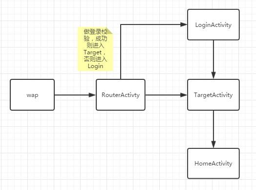
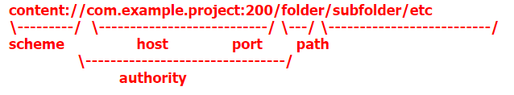

# Wap2App
### 一、Wap2App启动的实现

##### 1、需求（从Wap唤起查看分享）

​	从Wap界面调起App，校验是否登录，然后进入指定界面，最后点击back键后能回到App主界面。并且保证冷启动与热启动行为一致。

##### 2、实现思路

- 配置category让浏览器能打开指定Activity，配置data属性通过Uri传递需要的数据
- SingleTask模式实现Task的管理

##### 3、基本结构



##### 4、实现细节

1、与wap的约定

```html
<a id="open-egeio" href="com.example.egeiowap2app.scheme://host-photo/share-link-token">立即打开//</span></a></br>
```



主要约定href对应的uri格式。

- scheme：自定义定值，建议为包名.scheme，用于让浏览器找到RouterActivity


- host：建议为预览类型


- path：建议为share-link-token

确定scheme的值就可成功启动，host与path字段可以用来传递数据，具体可以协商定义。

2、RouterActivity

进行登录校验，并且可以根据提取出的host来决定需要启动哪一个TargetActivity，假如有多个TargetActivity的话。

为了让浏览器能以它为入口启动App，需要配置：

```xml
<intent-filter>
    <action android:name="android.intent.action.VIEW"/>
    <category android:name="android.intent.category.DEFAULT"/>
    <category android:name="android.intent.category.BROWSABLE"/>
    <data android:scheme="com.example.egeiowap2app.scheme"/>
</intent-filter>
```

tips：

- android:scheme的值要与href指向的uri的scheme值一致
- 如果不配置singleTask，则RouterActivity与浏览器位于同一个Task，根据实际需求决定需不需要配置。

3、TargetActivity

为了保证不论冷启动还是热启动，按返回键都能回到HomeActivity，需要重写如下方法：

```java
@Override
public void onBackPressed() {
    finishActivity();
    super.onBackPressed();
}

private void finishActivity() {
    Intent intent = new Intent(TargetActivity.this, HomeActivity.class);
    startActivity(intent);
    finish();
}
```

同时为了保证TargetActivity可以与App属于同一个Task，而不是与浏览器同一个Task，需要配置

> android:launchMode="singleTask"

4、HomeActivity

为了保证HomeActivity被启动后，永远都处于栈顶，需要配置

> android:launchMode="singleTask"

如果是热启动HomeActivity，则HomeActivity的onNewIntent()会被调用。

- 热启动：onNewIntent()->onStart()->onResume()，如果此时HomeActivity不在栈顶，则它上面的所有Acrivity均会直接调用onDestroy()出栈。


- 冷启动：onCreate()->onStart()->onResume()

5、替代方案

如果不想配置android:launchMode="singleTask"，则可采用如下方式：

```Java
intent.addFlags(Intent.FLAG_ACTIVITY_SINGLE_TOP);
intent.addFlags(Intent.FLAG_ACTIVITY_CLEAR_TOP);
```

则被启动的Activity等价于设置了android:launchMode="singleTask".


### 二、参考资料

- [Activity的任务栈Task以及启动模式与Intent的Flag详解](http://www.jianshu.com/p/c1386015856a#)


- [Intent 和 Intent 过滤器](https://developer.android.com/guide/components/intents-filters.html?hl=zh-cn#Receiving)